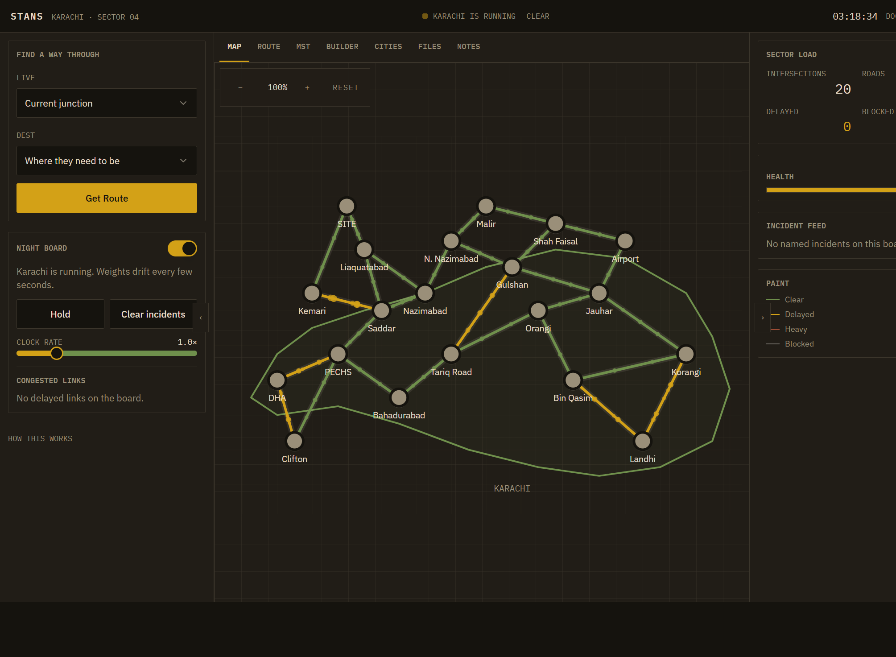
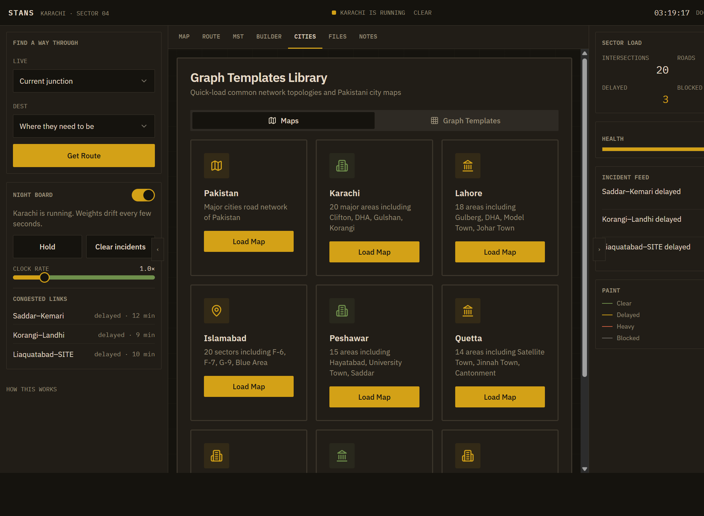

<p align="center">
  
</p>

<h1 align="center">STANS</h1>

<p align="center">
  <strong>Smart Traffic-Aware Navigation System</strong><br>
  A municipal traffic desk that treats a city as a living weighted graph.
</p>

<p align="center">
  <a href="https://github.com/Arnold-RG/STANS/actions/workflows/deploy.yml"></a>
  
  
  
  
</p>

<p align="center">
  <a href="#what-this-is">About</a> ·
  <a href="#the-desk">The desk</a> ·
  <a href="#how-routing-works">Routing</a> ·
  <a href="#features">Features</a> ·
  <a href="#run-it">Run</a> ·
  <a href="#docker-and-cicd">Docker</a> ·
  <a href="#repository-layout">Layout</a>
</p>

---

## What this is

STANS is a browser application for finding a way through a road network when traffic is not static. Junctions are **nodes**. Roads are **edges**. The cost of a hop is **minutes under live delay**, not raw distance.

The desk **opens empty**. No city, trip, unit, or dispatch event is preloaded. Load Karachi, Lahore, Islamabad, or another sector from Cities, import a graph, or draw one in Builder. Then pick a live junction and a destination. Dijkstra or A* walks the current weights (including the shift profile) and paints the path on the board.

This repository is also a full DevOps package: multi-stage Docker image, Nginx SPA routing, GitHub Actions to GHCR, and optional SSH / Terraform / Kubernetes deploy.

| | |
| --- | --- |
| Product | Traffic-operations desk (React + TypeScript + Vite) |
| Graph work | Dijkstra, A*, Kruskal, Prim, Union-Find |
| Cities | Optional templates only — nothing preloaded |
| Ship | `node:22-alpine` build → `nginx:1.27-alpine` image on port 80 |
| CI | `.github/workflows/deploy.yml` → `ghcr.io/arnold-rg/stans` |

## The desk

The map is the product. Side rails hold the route form and the incident feed. Phones get the map first and a bottom bar.

<p align="center">
  
</p>

<p align="center"><em>Empty board until a sector is loaded. Live / Dest on the left. Sector load on the right.</em></p>

<p align="center">
  
</p>

<p align="center"><em>Cities tab — load Pakistan, Karachi, Lahore, Islamabad, and the other sectors.</em></p>

On a phone the same app is usable: Map, Stats, Brief, Desk. Vite binds `::` on port **8080**, so other devices on the LAN can open it.

## How routing works

```
City graph
  nodes  = junctions (Clifton, Saddar, …)
  edges  = roads (minutes, traffic band, blocked flag)
        │
        ▼
Effective weight  =  minutes  ×  traffic band  ×  live multiplier  ×  shift scale
        │
        ├─ Dijkstra   →  one path under current closures
        ├─ A*         →  same costs, heuristic toward dest
        ├─ Via        →  two searches chained through a waypoint
        ├─ Kruskal    →  cheapest tree that still connects the sector
        └─ Prim       →  same MST, grown from a seed junction
```

**Traffic bands** (`low` / `medium` / `high`) sit on each edge. The night board multiplies those weights over time so a “clear” road can become delayed. Blocked edges drop out of the search. Dijkstra therefore answers a different question every few seconds: *what is the cheapest open path right now?*

Kruskal and Prim do not pick a single trip. They answer: *if I had to keep the whole sector connected with the cheapest set of roads, which ones stay?* That is the MST view.

You can also draw your own graph, import JSON/CSV, or switch city.

## Features

The desk ships these operations surfaces. None of them are filled until an operator loads a sector or writes them.

1. **Empty-board desk** — cold start, no dummy traffic. Clear board wipes the sector.
2. **Shift profiles** — Night / AM / Midday / PM scale every hop.
3. **Route desk** — Dijkstra and A*, via waypoint, alternate path, watch trip, copy/save.
4. **Saved trips** — recall a computed run without retyping junctions.
5. **Dispatch log** — closures, loads, routes, and exports in time order.
6. **Inspector** — junction degree, live delay, open/closed state.
7. **Closure queue** — list of blocked links with one-click reopen.
8. **Connectivity** — Union-Find components and isolated junctions.
9. **Heat index + analytics** — corridor pressure, hottest links, mean hop.
10. **Brief** — SITREP, operator sign-on, duty notes, field units, print/copy.

Also: command palette (`⌘K`), keyboard tabs, session JSON export, city templates, graph builder, file import, MST (Kruskal/Prim), dark desk by default, installable PWA, Alpine/Nginx production image.

## Stack

| Layer | Choice |
| --- | --- |
| UI | React 18, TypeScript, Vite, Tailwind |
| Algorithms | `src/utils/dijkstra.ts`, `kruskal.ts`, `prim.ts`, `unionFind.ts` |
| City data | Optional templates in `src/data/karachiNetwork.ts` and Cities |
| Container | Multi-stage Dockerfile, Nginx `try_files` |
| CI/CD | GitHub Actions → GHCR, optional SSH |
| IaC (optional) | Terraform (AWS), Ansible, Kubernetes manifests |

## Run it

```bash
git clone https://github.com/Arnold-RG/STANS.git
cd STANS
npm install
npm run dev
```

Open [http://localhost:8080](http://localhost:8080). On the same Wi-Fi, use the Network URL Vite prints (this machine has used `http://192.168.0.107:8080`).

```bash
npm run build
npm run preview
```

## Docker and CI/CD

```bash
docker build -t stans-app .
docker run --restart=always -p 8080:80 stans-app
```

Push to `main` runs [deploy.yml](.github/workflows/deploy.yml): validate the production build, push `ghcr.io/arnold-rg/stans`, and deploy over SSH if those secrets exist.

Server bootstrap, Certbot, firewall (22/80/443), Terraform, Ansible, Prometheus/Grafana, and Kubernetes are documented in [docs/DEPLOYMENT.md](docs/DEPLOYMENT.md).

## Repository layout

```
src/pages/Dashboard.tsx          # the desk (empty on start)
src/data/karachiNetwork.ts       # optional Karachi template
src/data/deskOps.ts              # shifts, log, trips, operator
src/utils/                       # Dijkstra, Kruskal, Prim, Union-Find
src/components/dashboard/        # map, route, ops panels, header
Dockerfile                       # node:22-alpine → nginx:1.27-alpine
.github/workflows/deploy.yml     # CI/CD
docs/DEPLOYMENT.md               # production notes
docs/branding/                   # logo files
docs/images/                     # desk screenshots
```

## Brand

**Use this logo.** It is the official mark: a junction (node) with one amber route through the night board.

<p align="center">
  
</p>

| File | Use |
| --- | --- |
| [docs/branding/logo.png](docs/branding/logo.png) | README, GitHub social preview, slides |
| [public/logo.svg](public/logo.svg) | App header and high-DPI |
| [public/favicon.svg](public/favicon.svg) | Browser tab |
| [docs/branding/icon.png](docs/branding/icon.png) | Alternate node-only icon |
| [docs/branding/wordmark.svg](docs/branding/wordmark.svg) | Horizontal lockup |

GitHub: **Settings → General → Social preview** → upload `docs/branding/logo.png`.

Colours: asphalt `#16140f`, cream `#e6dcc8`, sodium amber `#d4a017`.

## License

[GNU GPL-3.0](LICENSE)

---

Started as a Data Structures and Algorithms project at Bahria University, Karachi (BSE-3B; Engr. Majid Kalim, Engr. Saniya Sarim). This fork packages the desk for production.
