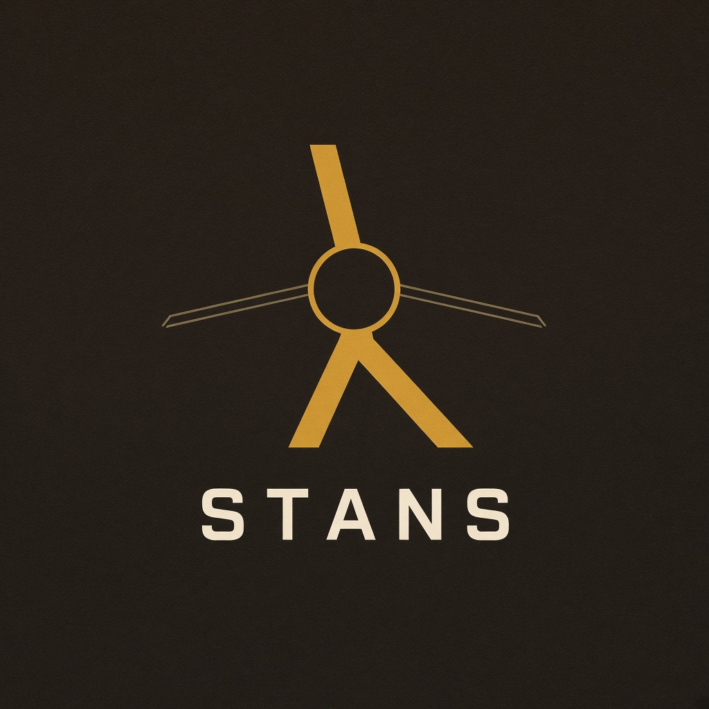

<p align="center">
  
</p>

<h1 align="center">STANS</h1>

<p align="center">
  Live traffic desk on real map data.<br>
  <a href="https://arnold-rg.github.io/STANS/">Open the desk</a>
  ·
  <a href="https://github.com/Arnold-RG/STANS">Source</a>
</p>

<p align="center">
  <a href="https://github.com/Arnold-RG/STANS/actions/workflows/pages.yml"></a>
  <a href="https://github.com/Arnold-RG/STANS/actions/workflows/deploy.yml"></a>
  
</p>

The public build lives here:

**https://arnold-rg.github.io/STANS/**

Phone, tablet, or laptop — that URL is enough. There is no Vercel staging link on this repo.

## What you actually get

The old schematic city (fake junctions, random congestion) is gone. The board is an OpenStreetMap map. Search talks to Nominatim. Drive / cycle / walk talks to the public OSRM server. Weather is Open-Meteo. Nearby hospitals and fuel come from Overpass. If a service is slow or empty, the desk says so. It does not invent traffic.

OSRM uses OSM road speeds, not camera feeds. I left that honest on the panel: morning peak on your clock is a note, not a multiplier.

## Desk modules

| # | Module | Source |
| --- | --- | --- |
| 01 | Place search + map click | Nominatim reverse/forward |
| 02 | GPS from-point | Browser geolocation |
| 03 | Drive / cycle / walk | OSRM profiles |
| 04 | Live trip time & distance | OSRM |
| 05 | Alternate geometry when OSRM has one | OSRM `alternatives=true` |
| 06 | Turn list | OSRM steps |
| 07 | Weather, humidity, wind, elevation, climb | Open-Meteo |
| 08 | Nearby hospital / police / fire / fuel | Overpass |
| 09 | Extract OSM highways in view, Dijkstra + Kruskal | Overpass + local graph code |
| 10 | Save on this device, copy URL, GPX | localStorage / clipboard |

Tiles: Carto night, OSM standard, Esri imagery. Attribution stays on the map.

## Run locally

```bash
git clone https://github.com/Arnold-RG/STANS.git
cd STANS
npm install
npm run dev
```

Vite listens on port **8080** (`host: ::`). Same Wi-Fi devices can use the Network URL it prints.

The live APIs are public demo endpoints. Nominatim asks for one request per second; the search box is debounced. Zoom in before extracting highways or Overpass will refuse a huge bbox.

## Docker

```bash
docker build -t stans-app .
docker run --restart=always -p 8080:80 stans-app
```

Image build on `main`: `.github/workflows/deploy.yml` → `ghcr.io/arnold-rg/stans`. Pages build: `.github/workflows/pages.yml` with `VITE_BASE=/STANS/`.

Production notes (SSH, Certbot, UFW, Terraform, k8s) are in [docs/DEPLOYMENT.md](docs/DEPLOYMENT.md).

## Layout

```
src/pages/Dashboard.tsx     desk
src/lib/live/               Nominatim, OSRM, Overpass, weather, GPX
src/components/live/        map, search, header
src/utils/                  Dijkstra, A*, Kruskal, Prim, Union-Find
Dockerfile                  node:22-alpine → nginx:1.27-alpine
```

## Brand

Asphalt `#16140f`, cream `#e6dcc8`, sodium amber `#d4a017`. Logo files are under `docs/branding/` and `public/`. GitHub social preview: **Settings → General → Social preview** → `docs/branding/logo.png`.

## License

[GNU GPL-3.0](LICENSE)

Map data © OpenStreetMap contributors. Routes: OSRM. Weather: Open-Meteo.

## Author

**Arnold Rurangwa** · ARNOVA Group
